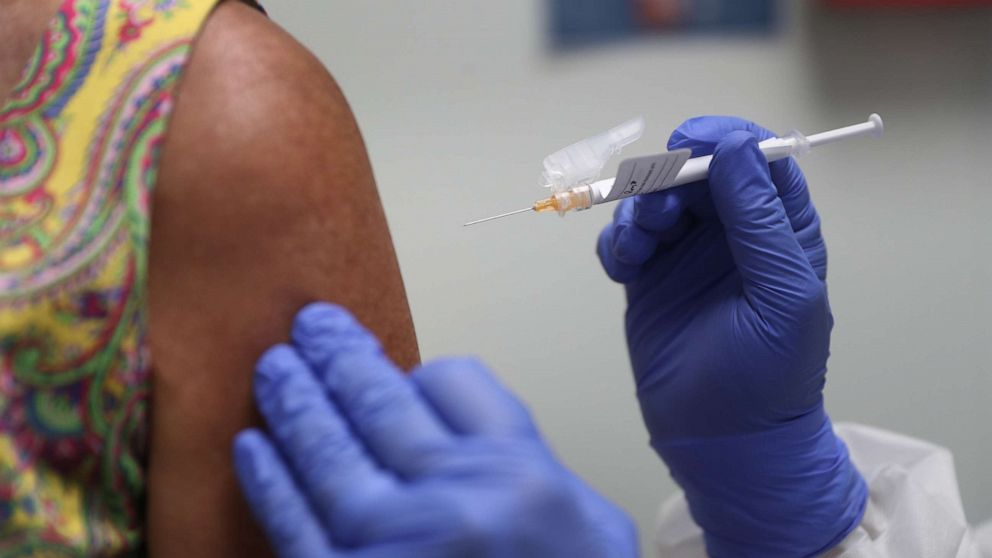
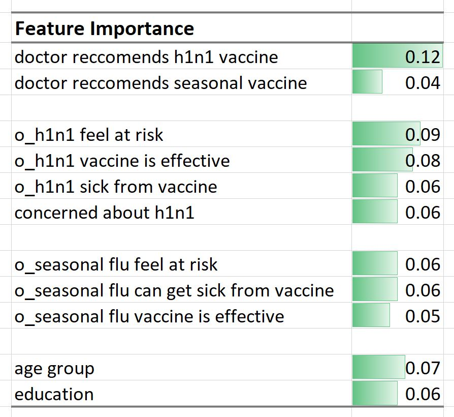
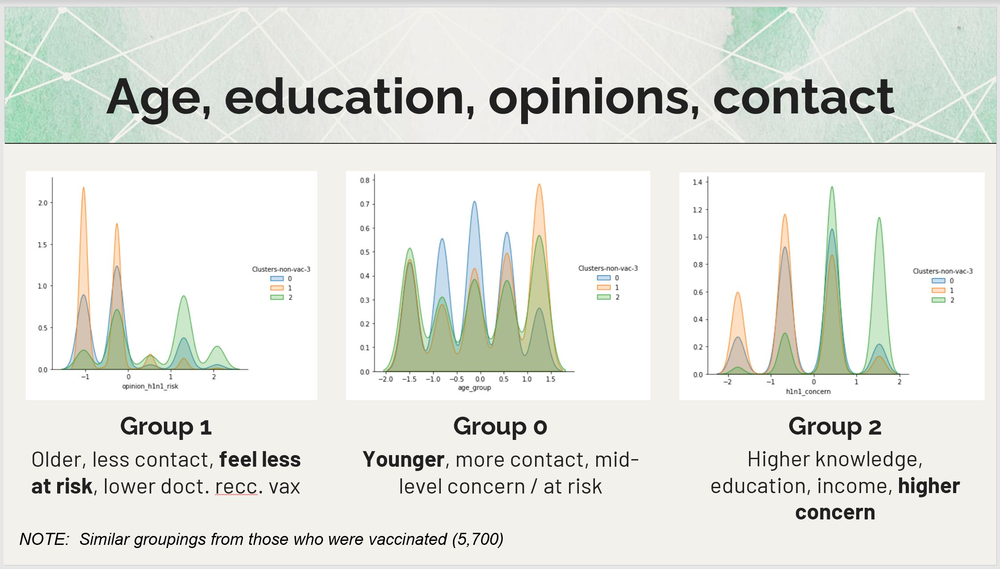
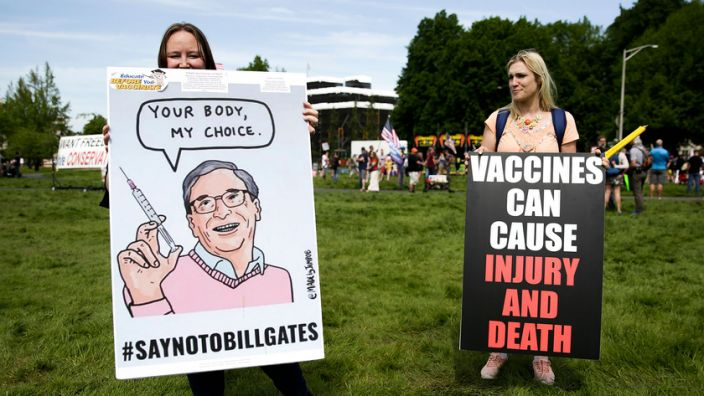

# Using Survey Data as a Predictor of Pandemic Vaccination
Capstone Project by Mark Patterson, March 2021
 
 

 
 
## Introduction
We are in the midst of a pandemic affecting all of us… here in the USA and globally. As of March 1st, just over a year into the COVID-19 pandemic, we have seen 29 million confirmed cases, and more than 525 thousand deaths -- in the USA alone. Vaccination against the virus is one of the key ways to curb it's spread. In the US, vaccinations began on Dec. 20th, but to date only 15.5% of population have had one dose and just 7.8% are fully vaccinated. For a vaccination approach to work, we need upwards of 80% of the population to be vaccinated. But unfortunately, not everyone is onboard with this. In a poll conducted in December, only 49% of adults under 65 said they were "absolutly certain," or "very likely" to get vaccinated.

So I decided to look to the past, and hopefully gain some understanding around who gets vaccinated and why. Back in the spring of 2009, there was another pandemic - the swine flu or H1N1 virus. It was not as contagious, nor as devastating (about 12.5K deaths in USA), but still a very serious health issue. I found the results of a survey on the H1N1 flu conducted in 2009/2010 by the CDC. So I wanted to see if I could look at data from the past to help provide answers that would be relevant to now and the future. I wanted to understand what contributes most to someones likelihood to get vaccinated, is it about who you are and where you live? Is it about your behaviors during a pandemic, or is it your opinions and attitudes? 
 
 

## Analysis Questions
This led me to 4 key questions: 
1) Can we use results of a public opinion survey to predict if people did or did not get an H1N1 vaccination? If so, how well can it predict? 
2) What are the key factors that help predict if people did or did not get vaccinated?
3) Are there any other underlying patterns or groupings that can help us identify who did or did not get vaccinated? 
4) And then linking this to the present… To improve chances of more people getting vaccinated, what questions about the COVID vaccine and vaccination need to be addressed? What are the concerns and misperceptions? 
 

## Data and Analysis Approach
The historical data was sourced from The National 2009 H1N1 Flu Survey (conducted by the NCIRD and NCHS/CDC) designed to monitor influenza immunization coverage in the 2009-2010 season. What was interesting about this survey is that it inlcluded a combination of data on behaviors, attitudes, and demographics. The dat set contained 26.7 thousand responses and the responses to 36 questions. The target variable, whether the responddent had gotten the H1N1 vaccination was imbalanced with only 21% of respondetns having gotten the vaccination. 

To look at current day pandemic sentiment, I obtained approximately 60K Tweets about the Covid vaccination from February 2020 to February 2021 (English language only) utilizing Twint to collect these from Twitter. 

I took a multi-method approach to analyzing the data as shown in the graphic below. The steps built upon each other, and also served as a way to corroborate the findings.

 

## A: Classification Modeling
**Preprocessing:** The data conssted of a combination of numeric and categorical variables. A combination of Ordinal Encoer and One-Hot Encoding to change categorical values to numerical. I decided to keep as much of the dataset as possible, so used KNN Imputing to address missing values. Standard Scaler was used to make sure variables were all of a similar magnitude. SMOTE was tried as a way to address the class imbalance 4 to 1, but this resulted in limited improvement during modeling. In the end a total of 73 variables were included in the model.

**Modeling:** Various data preperations were used across 6 classification models. The best performing model was **XGBoost with an accuracy of 0.84 and a precission for class 1 (got vaccinated) of 0.71.** This means that of the people the model missclassified 29% of people - predicting that they had been vaccinated when in fact they had not. This is important as it could mean people that needed additional vaccination informaiton may get overlooked.

**Important factors:** After examining the feature importances from the model (Random Forest model), simplification of the model was done by reducing the number of variables to just those that were most important. The model perofrmance held for both 19 features and 10 features. As seen in the table below, a Doctor's recommendation, as well as opinions about the risk of catching the H1N1 and belief that the vaccine was effective contributed the most to the model. The demographics of age group and education contributed less, but were also importent. 

 

## B: Clustering
To determine if there were any other patterns to who did'nt get vaccinated for H1N1, I conducted K-Means Clustering (an unsupervised learning approach) with the sub-set of respondents who had not gotten vaccinated (21K) and a set of 19 variables (the data included KNN Imputing and Standard Scaling). Three clusters were used (from 3 to 5 were suggested by an HAC dendrogram and K-Means inertia scores). There were a few meaningful patterns that corroborated the feature importances from the modeling. These distinctions betwen the three groups are shown below.

 

## C: Natural Language Processing (NLP)
Twint was used to "scrape" Twitter for tweets from the past year. Both neutral search terms (covid vaccination) and negative search terms (covid death; vaccine choice) were used as I wanted to find tweets that contained negative and misinformation that might prevent people from gettign vaccinated. The TextBlob library was used to assign sentiment to each tweet and then the set of negative sentiment tweets were the focus of the analysis. After preprocessing of the text data, word counts - single, bi-grams, and tri-grams were examined, and then LDA (soft clustering) was used to look for additional topic groups. A small set of tweets was read for additional context and understanding. Through this analysis several themes emerged. This included: 
1) **vaccine focused:** ineffective; rushed; not thouroughly tested; serious/longterm side effects (or death)
2) **vaccination process:** forced; lack of freedom to choose; restrictions as a result of not getting vaccinated
3) **action oriented:** sign petitions; protest vaccination sites; contact govt. officials
4) **news or celebrity focused (blame):** Bill Gates; WHO; Dolly Parton; the church; government; big pharma; Jan Andolan

 

## Takeaways and Recommendations
Based on this analysis, the key takeaways are:  
1) A relatively short survey can be used to help predict if someone got vaccinated or not, at least in the case of the H1N1 virus.
2) The most important predictors for machine learning classification models (and corroborated via clustering) included opinions about the virus and a recommenndation from a doctor.
3) Since public information plays a big role in shaping opinions, topics and concepts can be gleaned from social media (tweets) to understand concerns and misinformation regarding vaccines and vaccination programs.
4) The findings of this analysis can serve as a feedback loop to help refine and field future surveys and data collection efforts.

 
This leads me to the following recommendations:  
1. Ensure that doctors, at all levels, are recommending to patients that they get vaccinated. This raises issues of equity and access to healthcare and systemic racism). People of authority in the community can potentailly serve as a proxy for doctor / medical recommendations.  
2. Opinions shape peoples behavior and are an important factor especially in understanding the risk posed by a pandemic, and the methods we can use to prevent the spread and to eliminate it (vaccine / vaccination efforts). We need to ensure there is accurate, clear, and persuassive information avaialble to all.
3. Further explore what people need to be targeted with information and education programs, based on age, education, and occupation. Although not part of this analysis, location could also be a key factor. 
4. Keep alert to trending topics to counter misinformation, conspiracy theories, and politically motivated untruths and distrust of science, government, etc. There is a need to bridge the competing messagages at the state versus federal level (this has only been made more difficult by the recent political climate). 
 
